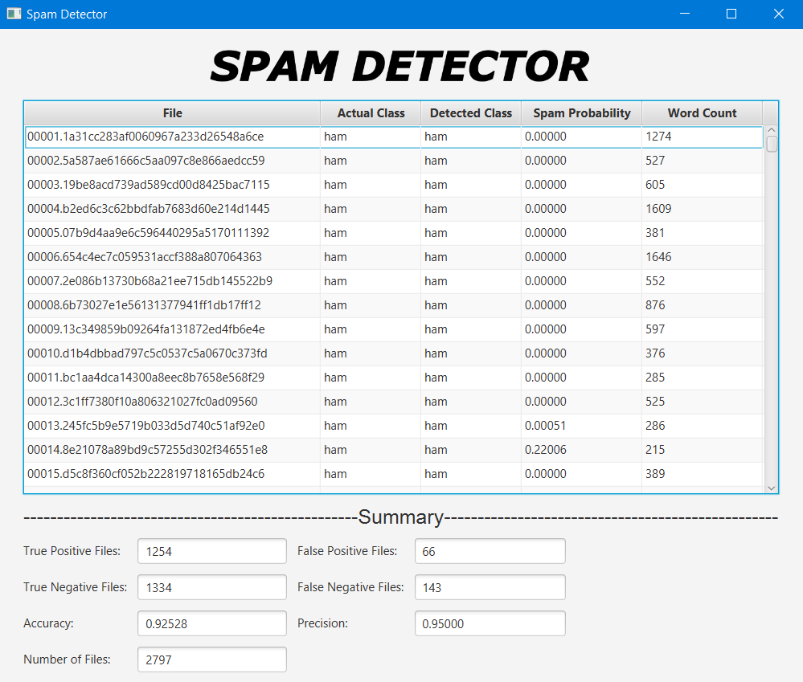

# CSCI2020U Assignment 1 - Thinh Le
# Bayesian Spam Detector

## Project Information: 
**This project is a spam detector based on Naive Bayes spam filtering algorithm. The application has two phases, training and testing.**
* When started, the user is asked to input a directory that a train folder and a test folder. Within each of these two folders, the spam messages are in a spam folder, and the ham messages are in a folder called ham.
* In the training phase, the application goes over all of the emails in the train/ham and train/spam folders and computes two word-frequency maps, trainHamFreq and trainSpamFreq, based on **Bag-of-words model**. The map trainHamFreq contains a map of words and the number of files containing that word in the ham folder. The map trainSpamFreq contains a map of words and the number of files containing that word in the spam folder. After that, the application computes one more map, contains the probability of each word that appears in a spam file, using the formula derived from **Bayes' theorem**.
* In the testing phase, the application examines two more folders: test/ham and test/spam. Each file in both directories will be examined, word by word. The ham and spam probabilities for each word in a file will be used to compute a probability that the file is spam, using the formula from **Naive Bayes spam filtering** algorithm.
* Once training and testing have been completed, the application displays the results in a TableView, including columns for the filename (which is unique), the spam probability of the file, and the actual category (which is already known, based on the folder name). At the bottom of the window, there are some summary stats, including the percentage of correct guesses (accuracy) and the ratio of correct positives (spam) to
spam guesses (correct or not) (precision).

## Improvements:
* Model: The application also uses **Laplace smoothing** technique to avoid the zero probability problem in the Naive Bayes algorithm. As a result, the accuracy and precision ratio of the detector increase. I also examined with the case sensitivity of the word in training and testing phases to get higher accuracy and precision.
* Interface: Title is added at the top. The TableView has two more column displays the categorization of the file after testing, and the number of words in each file. The summary section also has more stats displayed, such as number of correct spam detected files, number of incorrect spam detected files, number of correct ham detected files, and number of incorrect ham detected files.

## How To Run:
1. Clone this repository into your local machine, [instruction](https://docs.github.com/en/github/creating-cloning-and-archiving-repositories/cloning-a-repository)
2. Recommend using IntelliJ IDEA to run the program, [instruction](https://www.jetbrains.com/idea/download/#section=windows)
3. Set up JavaFX environment in IntelliJ IDEA, [instruction for MacOS](https://www.jetbrains.com/help/idea/javafx.html), [instruction for Windows](https://youtu.be/Ope4icw6bVk)
4. Set up data folder structure: check _assignment1\_data\_modified.rar_ as an example
  * data
    * train
      * spam
      * ham
    * test
      * spam
      * ham
5. Run the program, choose the data folder that you want the program to train and test on

## Other Resources:
[1] [Naive Bayes spam filtering](https://en.wikipedia.org/wiki/Naive_Bayes_spam_filtering)

[2] [Bag-of-words model](https://en.wikipedia.org/wiki/Bag-of-words_model)

[3] [Laplace Smoothing](https://en.wikipedia.org/wiki/Additive_smoothing)